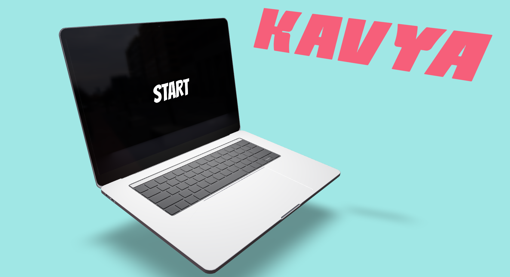
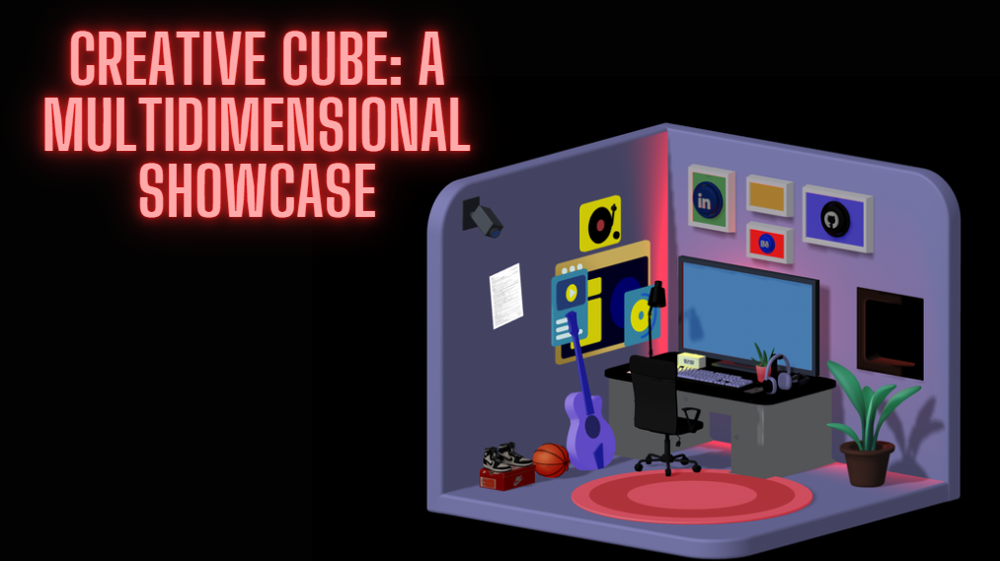
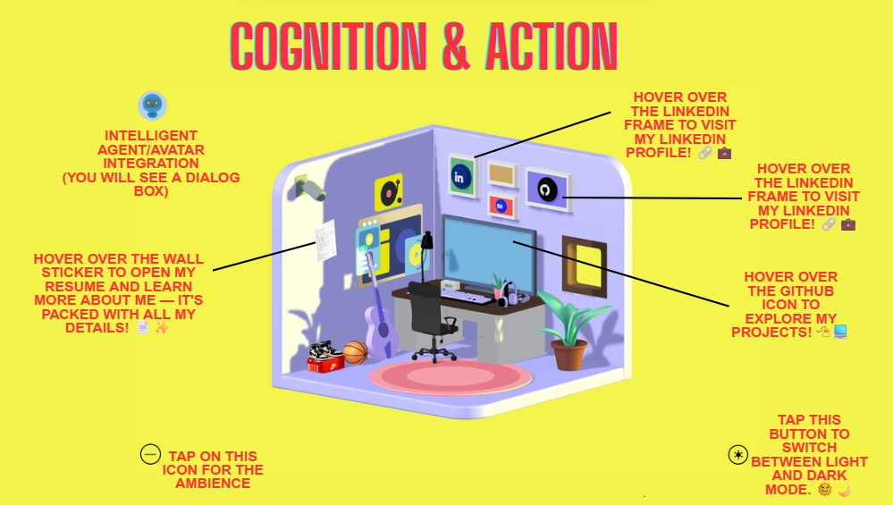

# 💻 My 3D Portfolio Website

Welcome to my **interactive 3D portfolio**, crafted using **React**, **React Three Fiber**, and **Three.js**!  
This isn't just a website — it's a **digital experience** where creativity meets code. 🚀

MY WEBSITE 💫 [LINK](https://kavya-choudhary-portfolio.netlify.app)

---

## ✨ Features

- 💻 A **realistic 3D laptop** that opens up to reveal the portfolio inside
- 🏠 An **interactive 3D room** showcasing my interests, passions, and projects
- 🌙 **Dark mode** support for that sleek, modern vibe
- 🖱️ **Clickable elements** and smooth transitions using camera & lighting effects
- 🎯 A creative mix of storytelling, design, and development

---

## 📸 Preview

### 🧠 Welcome Screen


### 🌀 Creative Cube: A Multidimensional Showcase


### 💡 Cognition & Action


> _Explore the space, interact with elements, and discover hidden easter eggs that represent who I am._

---

## 🛠️ Tech Stack

- **React**
- **React Three Fiber** (Three.js + React integration)
- **Three.js**
- **Framer Motion**
- **Tailwind CSS**

---

## 🚀 Getting Started

To run this project locally:

```bash
git clone https://github.com/yourusername/3d-portfolio.git
cd 3d-portfolio
npm install
npm start
